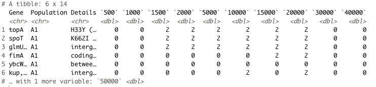
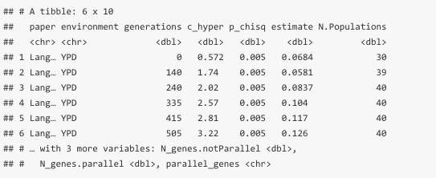
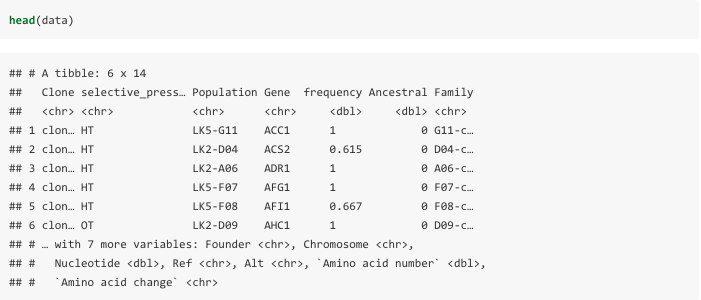
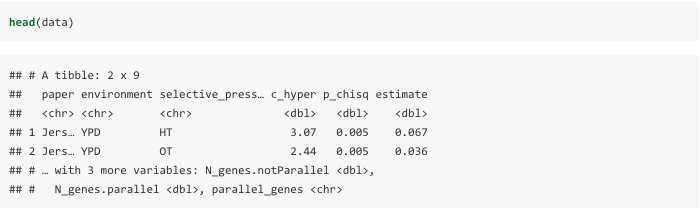
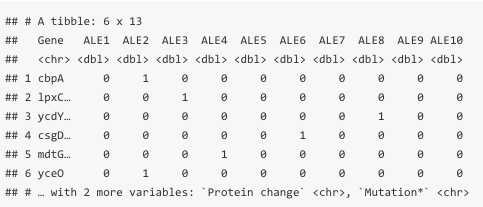
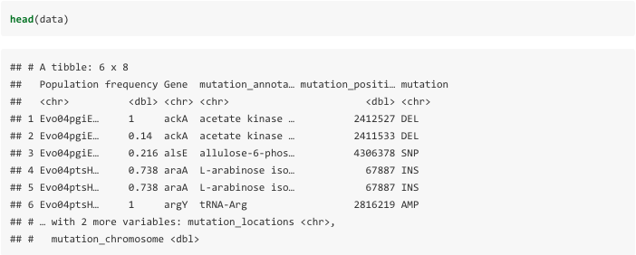
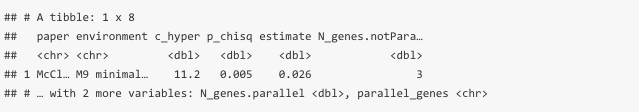

```{r setup, include=FALSE}
knitr::opts_chunk$set(echo = TRUE)
library(png)
library(grid)
```
The `dgconstraint` package provides functions for calculating the constraint metrics described in the manuscript [Quantifying how constraints limit the diversity of viable routes to adaptation](https://journals.plos.org/plosgenetics/article?id=10.1371/journal.pgen.1007717)

## Guide  
### Step 1: Setting up    
* Before you start analyzing, there are a few things you need to do:  
  + You need to find useful data and save them as "Author2017" in the csv format.  
  + You need to create a data-in and data-out foulder; data-in will contain the data/papers you would like to analyze, data-out will contain the analysis of the paper 	after all the calculations have been completed.  
  + You will need to decide which function will work with your data, depending on if it has multiple generations, multiple selective pressures, a single generation in matrix form or a single generation in non-matrix form.

### Step 2: Working with the data
Not all of the data that you will come across will be perfect. Some of the data might need to be adapted to work in the following functions.  
i.e: This following data set does not look like it has any frequencies, but the X's indicate if the gene is present at that time point and so you can replace the X's with 1's and the blank squares with 0 in the dataset to make it run in the function.
```{r, echo=FALSE, out.width = '75%', fig.pos = "H", fig.align="center"}
knitr::include_graphics("figures/Sandberg_1.png")
```

Here the coloured boxes indicates that the gene was present at that time point, and thus replace the coloured boxes with 1's and the blank boxes with 0's. 
  
    

```{r, echo=FALSE, out.width = '75%', fig.pos = "H", fig.align="center"}
knitr::include_graphics("figures/Creamer.png")
```
  
    
And in other cases the column names that are needed in the following functions might not be the same as the ones provided in the data. For these two examples on top, you need to have a *Gene* column. For example, instead of the needed name *Gene*, the data might have, gene (non-capitalized), Genes (plural) or genes (both). If that is the case, then you must change the name to *Gene*, either by the code  

```{r, echo=TRUE, eval = FALSE}
names(data)[1] <- Population
```
having the column number associated to the name you want to change (i.e., instead of [1]) or by changing it manually in the data. The same follows for *Population*, *Frequency* and *Selective_pressure* in the other functions.  

#### Data manipulation example  
Not all data will be perfect to work with (in fact almost no data is perfect to work with), here is an example of a dataset that I had to manipulate in order to use the function.

```{r, echo=FALSE, out.width = '75%', fig.pos = "H", fig.align="center"}
knitr::include_graphics("figures/Wannier_1.png")
```

This dataset is looking like the single generation matrix form, but when reading the paper it indicates that *A1 F1 I1 R1* and *A1 F1 I2 R1* are two clones from the same population. So we would want to combine those two columns as population *A1*, with a 0 when both clones have an *NA* and a 1 when either of the clones have a *1*. Here's what I did to obtain the prefered dataset.  

```{r, eval=FALSE}
data<- data %>% transmutate(A1 = `A1 F1 I1 R1` + `A1 F1 I2 R1`, A2 = `A2 F1 I1 R1`+ `A2 F1 I2 R1`, A3 = `A3 F1 I1 R1`+ `A3 F1 I2 R1`, A4 = `A4 F1 I1 R1`+ `A4 F1 I2 R1`, A5 = `A5 F1 I1 R1`+ `A5 F1 I2 R1`, A6 = `A6 F1 I1 R1`+ `A6 F1 I2 R1`, A7 = `A7 F1 I1 R1`+ `A7 F1 I2 R1`, A8 = `A8 F1 I1 R1`+ `A8 F1 I2 R1`, A9 = `A9 F1 I1 R1`+ `A9 F1 I2 R1`, A10 = `A10 F1 I1 R1`+ `A10 F1 I2 R1`,A11 = `A1 F1 I1 R1`+ `A11 F1 I2 R1`, A12 = `A12 F1 I1 R1`+ `A12 F1 I2 R1`, A13 = `A13 F1 I1 R1`+ `A13 F1 I2 R1`, A14 = `A14 F1 I1 R1`+ `A14 F1 I2 R1`) %>% replace(is.na(.), 0)
```

I used the `transmute` function to combine both columns, then name them by their population name, A1, A2, and so on. I replaced the *NA* with 0 with replace(is.na(.), 0)) and now the dataset looks like this:  

```{r, echo=FALSE, out.width = '75%', fig.pos = "H", fig.align="center"}
knitr::include_graphics("figures/Wannier_2.png")
```

Now all that's left to do is to change the 2's to 1's. If we left them as 2's, the number of parallel genes would be off. To switch them to ones, I did the following:  
```{r, echo=FALSE}
print("data.matrix[data.matrix > 0]<-1")
```

And the dataset now looks like this:  

```{r, echo=FALSE, out.width = '75%', fig.pos = "H", fig.align="center"}
knitr::include_graphics("figures/Wannier_3.png")
```

The data is now in a way that we can use the function!  

There are other ways to code the data to look the way we want. This is a basic way to do it, but other functions will work aswell. You might have to do this for datasets of the other types of function, but it is all the same idea, refer to the types of functions below to see how the data should look like.    

  
Another example of setting up the data for analysis:  
We can see that the column names give us alot of information, the population(i.e A1), the generation(i.e 500), clones(i.e I1 and I2) and the number of replicates(i,e R1). To get the data to look like the form in the muplie generation function, we need a *Population* column, to combine the clones, and to change the column names to what we want the generations to be.    

First I made a new column and called it *Population* and added the proper population to the data. In this case we have 6 populations, and so we will have A1 to A6.    
i.e .,
```{r, echo=FALSE, out.width = '75%', fig.pos = "H", fig.align="center"}
knitr::include_graphics("figures/Tenaillon_1.png")
```
```{r, echo=FALSE, out.width = '75%', fig.pos = "H", fig.align="center"}
knitr::include_graphics("figures/Tenaillon_2.png")
```
And now I have to combine both clones into one column and name that column `500`, for the 500th generation and change the NA's to 0.  

```{r, echo=FALSE}
print("data <- data %>% transmute(Gene = data$Gene, Population = data$Population, Details = data$Details, `500` = `500 I1 R1`+`500 I2 R1`, `1000` = `1000 I1 R1`+`1000 I2 R1`, `1500` =`1500 I1 R1`+`1500 I2 R1`, `2000` = `2000 I1 R1`+`2000 I2 R1`, `5000` = `5000 I1 R1`+`5000 I2 R1`, `10000` = `10000 I1 R1`+`10000 I2 R1`, `15000` = `15000 I1 R1`+`15000 I2 R1`, `20000` = `20000 I1 R1`+`20000 I2 R1`, `30000` = `30000 I1 R1`+`30000 I2 R1`, `40000` = `40000 I1 R1`+`40000 I2 R1`, `50000` = `50000 I1 R1`+`50000 I2 R1`) %>% replace(is.na(.), 0)")
```

In this case it doesn't matter if the gene count in each column if off due to adding the columns together because we have a code in the function that changes any value greater then 0 to a 1. Ans so now the dataset will look like this:  

```{r, echo=FALSE, out.width = '75%', fig.pos = "H", fig.align="center"}

```

### Step 4: Walk-Through
By now you should have made your files, chosen a dataset you want to analysis and saved it as "Author2018" in he csv format, decided which of the following functions works best for that data set and checked to see if the data has the proper format.  
And now you are ready to start analyzing your data!  
I will use the multiple generations function as an example for the walk-through.  

* *multigen_c_hyper(paper, environment, species, generations)* is the function we are using:    
  + set the parameter *paper* = "Author2018"  
  + set the parameter *environment* to the environment used in the experiment, lets say "YPD"  
  + set the parameter *species* to either Sac" or "Ecoli_K12" or "Ecoli_O157-H7", lets say "Sac".  
  + set the paramter *generations* to the number of generations in the dataset in a vector format, lets say c("0", "100", "500", "1000", "1500")    
  
And so your function will look like this:  
```{r, eval=FALSE}
multigen_c_hyper(paper = "Author2018", environment = "YPD", species = "Sac", generations = c("0", "100", "500", "1000", "1500"))  
```

Your function should be good to go!  

After you ran your code the analysis will be saved into the data-out folder that you already created. It should be called *"Author2018_Analysis.csv"*. Since this is a multiple generation example, you will also have seperate information for each generation, that will include the populations, genes and frequencies at that time point. It will also be saved in the data-out folder under the name "Author2018_g.csv", *g* being either 0, 100, 500, 1000 or 1500 for this example.  

### Step 5: Solving Errors
If you come across an error while running your function: 

* Make sure you picked the right function for your data, the single generation functions will not work in the multiple generation function and vice versa. Sometimes it is hard to distinguish between the functions, check the data format below in the each of the sections to help choose which functions is best for your data.      
* Double check that all the parameters are set properly and that they match the information in your data.      
* Make sure the column names are correct, it is easy to forget to change a column name gene to the needed one *Gene*. The code is ran in a way that it will recognize *Gene* and not gene. Same goes for *Population*, *Frequency* and *Selective_pressure*.    
* Lastly, if there is an error when it tries to calculate the c-hyper, that could be due to lack of parallelism, populations or genes in that generation/selective pressure. If you are unsure, take a look at the original data to see if it matches the conclusion of no parallelism.      
  
## Calculations for a Multiple Generation Function  
This function allows you to calculate the pairwise C-score using the hypergeometric approach, a p-value for 'all lineages' contrast using chi-square, and the	estimates of the effective proportion of adaptive loci for a data set with multiple generations.

### Data  
The data must have more than one generation, a column called *Populations*, a column called *Gene*, and frequencies associated with the Gene, Population and generation. The data can have other columns as well, but as long as we have the main ones named above, then the function will work.      
This data should be saved in the data-in folder that you created beforehand.

i.e.:
```{r, echo=FALSE, out.width = '75%', fig.pos = "H", fig.align="center"}
knitr::include_graphics("figures/Lang_1.png")
```

Here we can see that the generations are 0, 140, 335, 415, 505, 585 and so on. All the numbers below the generations are the frequencies associated with the *Gene* in the *Population*.   
e.g.: *Gene* UBX5 has a *Frequency* of 0.94 at *generation* 335 in the *Population* BYB1-B01.  

Now we have to fill in the parameters in the function: 
```{r, eval =FALSE}
multigen_c_hyper(paper, environment, species, generations)
```

If we use the data above as an example, then the function would look like this:  
*multigen_c_hyper("Author2014", "YPD", "Sac", c("0", "140", "240", "335", "415", "505", "585", "665", "745", "825", "910", "1000"))*  

### Results  
The package will give you the results in a table with all the information and calculations such as the paper, environment, generations, c-hyper, p-value, estimate, number of popuations, number of non parallel genes, number of parallel genes and a list of the parallel genes.  

i.e:
```{r, echo=FALSE, out.width = '75%', fig.pos = "H", fig.align="center"}

```
The analysis will be automatically saved into the data-out folder that you created beforehand.

## Calculations for Multiple Selective Pressure Function  
This function allows you to calculate the pairwise C-score using the hypergeometric approach, a p-value for 'all lineages' contrast using chi-square, and the estimates of the effective proportion of adaptive loci for a data set with  multiplte selective pressures.  

### Data  
The data must have more than one selective pressure, a column called *Populations*, a column 	called *Gene*, a column called *Frequency* and a column called *Selective_pressure*.    
This data should be saved in the data-in folder that you created beforehand.  

i.e:
```{r, echo=FALSE, out.width = '75%', fig.pos = "H", fig.align="center"}

```
Here we can see that the selective pressures are OT(Optimal Temperature) and HT(High Temperature).  
ex: *Gene* AFI1 has a *Frequency* of 0.6666667 in the *Population* LK5-F08 with the *Selective_pressure* HT.  

Now we have to fill in the parameters in the function: *multipressure_c_hyper(paper, environment, species, Selective_pressure)*  
If we use the data above as an example, then the function would look like this:  
*multipressure_c_hyper("Author2017", "YPD", "Ecoli_K12", c("OT", "HT"))*   

### Results  
The package will give you the results in a table with all the information and calculations such as the paper, environment, slective_pressure, c-hyper, p-value, estimate, number of non parallel genes, number of parallel genes and a list of the parallel genes.    

i.e:
```{r, echo=FALSE, out.width = '75%', fig.pos = "H", fig.align="center"}

```
The analysis will be automatically saved into the data-out folder that you created beforehand.  

## Calculations for a Single Generation Function in Matrix Form  
This function allows you to calculate the pairwise C-score using the hypergeometric approach, a p-value for 'all lineages' contrast using chi-square, and the estimates of the effective proportion of adaptive loci for a data set with a single generation in a matrix form.   

### Data  
The data must be in a form of a matrix, with the *Population* occupying either the names of the columns or the rows, usually column, and the *Gene* occupying the names of the columns or rows, which ever is not occupied by the Population. Each row and column will be filled with frequencies associated to a Gene in the Population.    
This data should be saved in the data-in folder that you created beforehand.  

i.e:
```{r, echo=FALSE, out.width = '75%', fig.pos = "H", fig.align="center"}

```
Here we can see that we have the *Population* as the column names, (ALE1, ALE2, ALE3, ALE4, ALE5, ALE6, ALE7, ALE8, ALE9 and ALE10), and the *Gene* as the row names. This data represents only one generation, usually the end point, and thus indicates a 1 if the *Gene* was present, and a 0 if the *Gene* was absent.    
ex: The *Gene* cbpA was only present in the *Population* ALE2 at this time point.  

Now we have to fill in the parameters in the function: *singlematrix_c_hyper(paper, environment, species, population)*
If we use the data above as an example, then the function would look like this:  
*singlematrix_c_hyper("Author2014", "glucose minimal media", "Ecoli_K12", c("ALE1", "ALE2", "ALE3", "ALE4", "ALE5", "ALE6", "ALE7", "ALE8", "ALE9", "ALE10"))*  

### Results  
The package will give you the results in a table with all the information and calculations such as the paper, environment, c-hyper, p-value, estimate, number of non parallel genes, number of parallel genes and a list of the parallel genes.  

i.e:
```{r, echo=FALSE, out.width = '75%', fig.pos = "H", fig.align="center"}

```
The analysis will be automatically saved into the data-out folder that you created beforehand.  

## Calculations for a Single Generation Functionin Non-Matrix Form  
This function allows you to calculate the pairwise C-score using the hypergeometric approach, a p-value for 'all lineages' contrast using chi-square, and the estimates of the effective proportion of adaptive loci for a data set with a single generation.

### Data  
The data must have a column called *Population*, a column 	called *Gene*, and a column *Frequency*. The data can have other columns as well, but as long as we have the main ones named above, the function will work.      
This data should be saved in the data-in folder that you created beforehand.

i.e:
```{r, echo=FALSE, out.width = '75%', fig.pos = "H", fig.align="center"}

```
Here we can see that we have a *Population* column, a *Gene* column and a *Frequency* column.  
ex: The *Gene* araA in the *Population* Evo04ptsHIcrrEvo03EP has a *Frequency* of 0.738 at this time point.  

Now we have to fill in the parameters in the function: *singlegen_c_hyper(paper, environment, species)*  
If we use the data above as an example, then the function would look like this:  
*singlegen_c_hyper("Author2018", "YPD", "Ecoli_K12")*  

### Results  
The package will give you the results in a table with all the information and calculations such as the paper, environment, c-hyper, p-value, estimate, number of non parallel genes, number of parallel genes and a list of the parallel genes.  

i.e:
```{r, echo=FALSE, out.width = '75%', fig.pos = "H", fig.align="center"}

```
The analysis will be automatically saved into the data-out folder that you created beforehand.  
